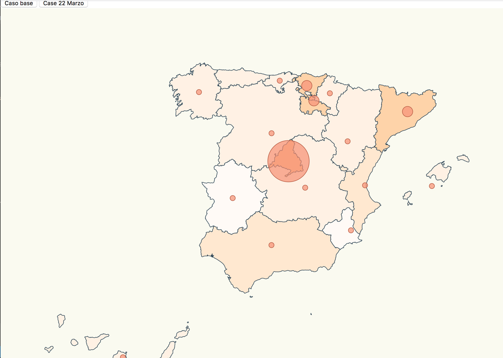
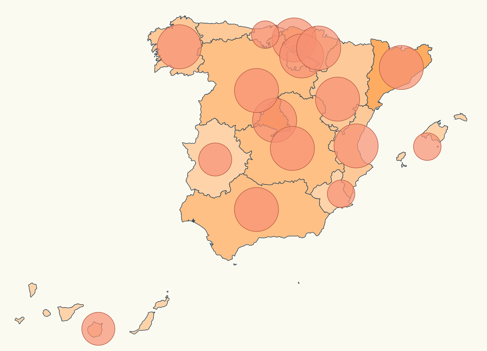

# Map Background Scale

Our boss got a link form a spanish news paper about choronavirus stats, he got astonished by the charts that we represented (https://elpais.com/sociencia/2020/03/03/actualidad/1583227754_157787.html), now we have to implement two chart that colors each Spain communities depending on heavy they have been affected by Choronavirus in two diferent case. Each chart have two indicator gravity:

- Represent the infected numbers with a circular marks in each commuty.

-  Represent the background colour map with a different scale of colour with a ratio of infected for each commuty.





# Steps

- On the first time that you start the project, you will install the necessary dependencies.
```bash
npm intall
npm install topojson-client --save
npm install @types/topojson-client --save-dev
npm install topojson --save
npm install @types/topojson --save-dev
npm install d3-composite-projections --save
npm install @types/node --save-dev
```
- When you have install all the dependencies, let's start the localhost server.
```bash
npm start
```

We have the following information:

Base use case (March 07)

| Community                  | Infected |
| -------------------------- | :------: |
| Comunidad de Madrid        |   587    |
| Páis Vasco                 |   148    |
| La Rioja                   |   102    |
| Cataluña                   |   101    |
| Andalucía                  |    54    |
| Comunidad Valenciana       |    50    |
| Castilla y León            |    40    |
| Aragón                     |    32    |
| Castilla-La Mancha         |    26    |
| Islas Canarias             |    24    |
| Galicia                    |    18    |
| Comunidad Foral de Navarra |    13    |
| Cantabria                  |    12    |
| Islas Baleares             |    11    |
| Principado de Asturias     |    10    |
| Región de Murcia           |     5    |
| Extremadura                |     7    |

22Marzo use case (March 07)

| Community                  | Infected  |
| -------------------------- | :------:  |
| Comunidad de Madrid        |   9702    |
| Páis Vasco                 |   2097    |
| La Rioja                   |    654    |
| Cataluña                   |   4704    |
| Andalucía                  |   1725    |
| Comunidad Valenciana       |   1604    |
| Castilla y León            |   1744    |
| Aragón                     |    532    |
| Castilla-La Mancha         |   1819    |
| Islas Canarias             |    414    |
| Galicia                    |    915    |
| Comunidad Foral de Navarra |    794    |
| Cantabria                  |    282    |
| Islas Baleares             |    331    |
| Principado de Asturias     |    545    |
| Región de Murcia           |    296    |
| Extremadura                |    384    |


- Let's define two arrays for each  infected use case table.

_./src/stats.ts_

```typescript
export const statsBase = [
  {
    name: "Comunidad de Madrid",
    value: 587
  },
  {
    name: "País Vasco",
    value: 148
  },
  
  {
    name: "La Rioja",
    value: 102
  },
  {
    name: "Cataluña",
    value: 101
  },
  {
    name: "Andalucía",
    value: 54
  },
  
  {
    name: "Comunidad Valenciana",
    value: 50
  },
  {
    name: "Castilla y León",
    value: 40
  },
  {
    name: "Aragón",
    value: 32
  },
  {
    name: "Castilla-La Mancha",
    value: 26
  },
  {
    name: "Islas Canarias",
    value: 24
  },
  {
    name: "Galicia",
    value: 18
  },
  {
    name: "Comunidad Foral de Navarra",
    value: 13
  },
  {
    name: "Cantabria",
    value: 12
  },
  {
    name: "Islas Baleares",
    value: 11
  },
  {
    name: "Principado de Asturias",
    value: 10
  },
  {
    name: "Región de Murcia",
    value: 5
  },

  {
    name: "Extremadura",
    value: 7
  }
  
];

export const stats22Marzo = [
  {
    name: "Comunidad de Madrid",
    value: 9702
  },
  {
    name: "Cataluña",
    value: 4704
  },
  {
    name: "País Vasco",
    value: 2097
  },
  {
    name: "Castilla-La Mancha",
    value: 1819
  },
  {
    name: "Castilla y León",
    value: 1744
  },
  {
    name: "Andalucía",
    value: 1725
  },
  {
    name: "Comunidad Valenciana",
    value: 1604
  },
  {
    name: "Galicia",
    value: 915
  },
  {
    name: "Comunidad Foral de Navarra",
    value: 794
  },
  {
    name: "La Rioja",
    value: 654
  },
  {
    name: "Principado de Asturias",
    value: 545
  },
  {
    name: "Aragón",
    value: 532
  },
  {
    name: "Islas Canarias",
    value: 414
  },
  {
    name: "Extremadura",
    value: 384
  },
  {
    name: "Islas Baleares",
    value: 331
  },
  {
    name: "Región de Murcia",
    value: 296
  },
  {
    name: "Cantabria",
    value: 282
  }
];

```

- Searched the communities location and define an array with the name, latitude and longitude for each community.

_./src/communities.ts_

```typescript
export const latLongCommunities = [
  {
    name: "Comunidad de Madrid",
    long: -3.70256,
    lat: 40.4165
  },
  {
    name: "Andalucía",
    long: -4.5,
    lat: 37.6
  },
  {
    name: "Comunidad Valenciana",
    long: -0.37739,
    lat: 39.45975
  },
  {
    name: "Región de Murcia",
    long: -1.13004,
    lat: 37.98704
  },
  {
    name: "Extremadura",
    long: -6.16667,
    lat: 39.16667
  },
  {
    name: "Cataluña",
    long: 1.86768,
    lat: 41.82046
  },
  {
    name: "País Vasco",
    long: -2.75,
    lat: 43.0
  },
  {
    name: "Cantabria",
    long: -4.03333,
    lat: 43.2
  },
  {
    name: "Asturias",
    long: -5.86112,
    lat: 43.36662
  },
  {
    name: "Galicia",
    long: -7.86621,
    lat: 42.75508
  },
  {
    name: "Aragón",
    long: -1.0,
    lat: 41.0
  },
  {
    name: "Castilla y León",
    long: -4.45,
    lat: 41.383333
  },
  {
    name: "Castilla-La Mancha",
    long: -3.000033,
    lat: 39.500011
  },
  {
    name: "Islas Canarias",
    long: -15.5,
    lat: 28.0
  },
  {
    name: "Islas Baleares",
    long: 2.52136,
    lat: 39.18969
  },
  {
    name: "La Rioja",
    long: -2.44373,
    lat: 42.4650
  },
  {
    name: "Comunidad Foral de Navarra",
    long: -1.676069,
    lat: 42.695391
  }
];
```

- Let's import on the project the spain set on type json.

_./src/spain.ts_

- Now you can start to write the principal script (index.ts). On the first time, have to do all import the dependencies on your principal script.

_./src/index.ts_

```typescript
import * as d3 from "d3";
import * as topojson from "topojson-client";
const d3Composite = require("d3-composite-projections");
const europejson = require("./europe.json");
const spainjson = require("./spain.json")
import {statsBase} from "./stats"
import {stats22Marzo} from "./stats"
import {latLongCommunities} from"./communities"
```
- Calculate the max number of infected on the communities for the base use case (Initialize calculus for first time).
```typescript
let maxAffected =   statsBase.reduce(
  (max,item) => (item.value > max ? item.value : max),0
);
```

- Now define the radius scales for represents the interval of infected for each community.
```typescript
const affectedRadiusBasedScale = d3
  .scaleQuantile()
  .domain([0, maxAffected])
  .range([5,10,15,25,30,35,40]);
 ```

- Let's now move on the calculate radius operations for each communities and use case.
```typescript
const calculateRadiusBasedOnAffectedCases = (comunidad: string, currentStats: any[]) => {
  let size = 0;
  const entry = currentStats.find(item => item.name === comunidad); 
  
  console.log(maxAffected)
        if(entry) {
            size = affectedRadiusBasedScale(entry.value);
                                      
        }
                                                                        
  return size;
};
```

- If we check the values the start from 10 to 10000 approx, let's assign a range of colores for that
  domain:
  
```typescript
 var color = d3
 .scaleThreshold<number, string>()
 .domain([10,50,70,100,500,1700,2000,2100,5000,10000])
 .range([
  "#fffaf6",  
  "#fff1e2",
  "#ffe7ce",
  "#ffddbb",
  "#ffd3a7",
  "#ffc994",
  "#ffc080",
  "#ffb66c",
  "#ffac59",
  "#ffa245",
  "#ff9832",
  "#ff8e1e",
  "#ff850a",   
 ]);
```
 

- Let's create a help function to map from community to color: we have to take into account that some communities  are not affected (won't exists on our list).

```typescript

const assignRegionBackgroundColor = (RegionName: string, currentStats: any[]) => {
  const item = currentStats.find(
    item => item.name === RegionName

  return item ? color(item.value) : color(0);
};
```
- Difined background painted zone to build the map.
```typescript
const svg = d3
  .select("body")
  .append("svg")
  .attr("width", 1024)
  .attr("height", 800)
  .attr("style", "background-color: #FBFAF0");
 ```
 - Let's change the projection we are using and adjusted  well the scale, put the map on the center of the page and translate values:
 
 ```typescript
 const aProjection = d3Composite
  .geoConicConformalSpain()
  // Let's make the map bigger to fit in our resolution
  .scale(3300)
  // Let's center the map
  .translate([500, 400]);
  
 const geoPath = d3.geoPath().projection(aProjection);


const geojson = topojson.feature(
  spainjson,
  spainjson.objects.ESP_adm1
);
 ```
  
- Now it's time to remove features that we need on the map render (mouse out, mouseover):

```diff
svg
  .selectAll("path")
  .data(geojson["features"])
  .enter()
  .append("path")
  .attr("class", "country")
  // data loaded from json file
  .attr("d", geoPath as any)
-  .on("mouseover", function(d, i) {
-    d3.select(this).attr("class", "selected-country");
-  })
-  .on("mouseout", function(d, i) {
-    d3.select(this).attr("class", "country");
-  });
```

- And add a fill style to match country name with corresponding background color (based on
  coronavirus affected people):

```diff
svg
  .selectAll("path")
  .data(geojson["features"])
  .enter()
  .append("path")
  .attr("class", "country")
+  .style("fill", function(d: any) {
+    return assignCountryBackgroundColor(d.properties.geounit);
+  })

  // data loaded from json file
  .attr("d", geoPath as any)
```

- To complete our styling journey, let's modify our country css class to provide a default
  background color to our countrie.

```diff
.country {
  stroke-width: 1;
  stroke: #2f4858;
-  fill: #008c86;
+  fill: #FFFFFF;
}

- .selected-country {
-  stroke-width: 1;
-  stroke: #bc5b40;
-  fill: #f88f70;
}
```

- Let's give a try

```bash
npm start
```

# About Basefactor + Lemoncode

We are an innovating team of Javascript experts, passionate about turning your ideas into robust products.

[Basefactor, consultancy by Lemoncode](http://www.basefactor.com) provides consultancy and coaching services.

[Lemoncode](http://lemoncode.net/services/en/#en-home) provides training services.

For the LATAM/Spanish audience we are running an Online Front End Master degree, more info: http://lemoncode.net/master-frontend
